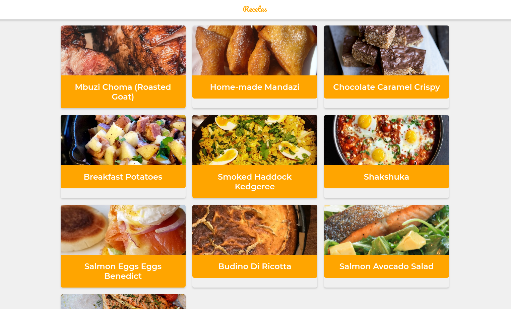

# platzi-recetas

PWA que utiliza el API de MealDB para mostrar recetas con sus instrucciones. Algunas de las features que tiene son:

* Soporte Offline con workbox.
* Estrategias de Red apropiadas para cada recurso.
* Add to home screen.
* Web Shared API

## ¿Como usar?

1. Debes tener instalado `node.js v10`
2. Clonar este repositorio en tu local
3. Ejecutar en la raiz del proyecto `npm install`
4. Ejecutar `npm run dev` para desarollo
5. Ejecutar `npm run build && npm start` para producción.
6. Enjoy

[DEMO LIVE](https://pwa-recetas.hecto932.now.sh)

## Licencia

MIT
